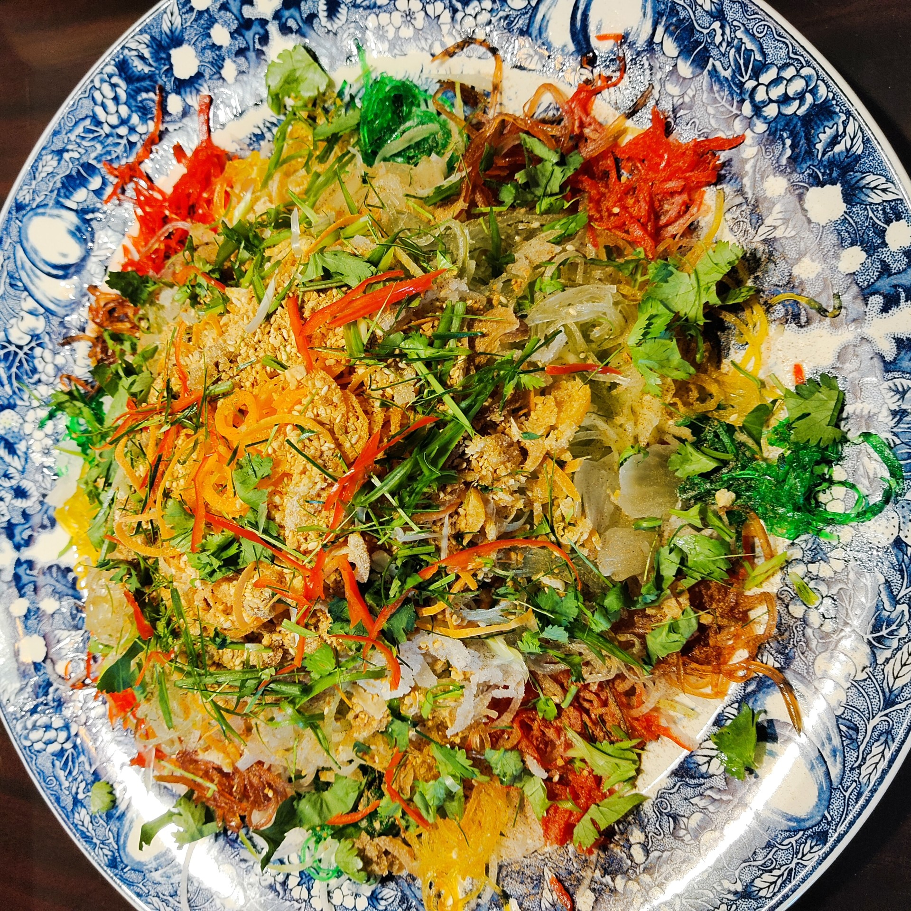

[Back to homepage](https://ah-jia.github.io/)

# Yu Sheng

[Instructional video](https://youtu.be/ZSIeSbt1eIo)

[Instructional video](https://youtu.be/ZSIeSbt1eIo)

## Ingredients
- 100 gm fish meat slices
- 150 gm radish shreds
- 75 gm carrot shreds
- 75 gm cucumber shreds or green radish shreds
- 50 gm jelly fish shreds
- 25 gm preserved sweet papaya shreds
- 25 gm preserved sour ginger shreds
- 25 gm preserved red ginger shreds
- 25 gm preserved sour leek shreds
- 25 gm pomelo meat
- 25 gm preserved candied orange
- 25 gm preserved candied winter melon
- 1 red chilli (cut into shreds)
- 1 stalk of spring onion (cut into 1 inch length and slice thinly)
- 2 lemon leaf (cut into very fine strips)
- 2 lime (squeeze out the juice)
- 2 tbsp ground peanut
- 1 tbsp roasted sesame seeds
- 50 gm crackers

## Serving Sauce
- 2 tbsp cooking oil
- 1 tbsp plum sauce
- 1 tbsp lemon sause
- 1/2 tsp pepper powder
- 1/4 tsp cinnamon powder or 5 spice powder

## Steps
1. Sprinkle lime juice over fish slices, add in cooked oil and mix a little. Sprinkle dash of salt and sesame oil. Then garnish with shredded chilli & spring onions.
2. Pile up radish, carrot and cucumber in the centre of a big serving plate. Arrange the preserved ingredients all round. Display the fish slices on top and pour evenly the serving sauce.
3. Lastly sprinkle the ground peanut, sesame seeds and crackers, toss well and serve.

[Back to homepage](https://ah-jia.github.io/)
